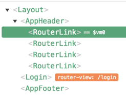
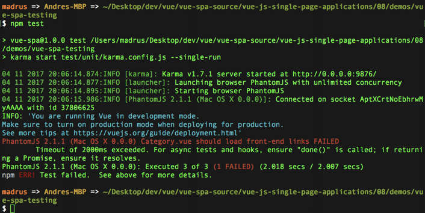

[](https://travis-ci.org/madrus/vue-spa)

# Single Page Application with Vue.js

## Installation

- install `editorconfig` plugin
- make sure you have the latest version of `yarn` installed:

  ```bash
  curl -o- -L https://yarnpkg.com/install.sh | bash
  ```

Project Initialisation

- `npm init -y`
- `yarn`
- `yarn add vue`
- `yarn add express`

Hot reload without `vue-loader`

- `yarn add webpack webpack-dev-middleware webpack-hot-middleware -D`

ESLINT

- `yarn add eslint eslint-loader eslint-plugin-html eslint-config-standard -D`
- `yarn add eslint-plugin-promise eslint-plugin-standard -D`
- `yarn add eslint-plugin-import eslint-plugin-node -D`
- `yarn add eslint-friendly-formatter eslint-plugin-vue -D`

Hot reload with `vue-loader`

- `yarn add vue-loader vue-template-compiler -D`

Babel

- `yarn add babel-core babel-eslint babel-loader babel-preset-es2015 babel-preset-stage-2 -D`

Bulma Styling

- `yarn add bulma`
- `yarn add css-loader node-sass sass-loader -D`

Extract Styles

- `yarn add extract-text-webpack-plugin -D`

Vue Router

- `yarn add vue-router`

Axios

- `yarn add axios`

Vuex

- `yarn add vuex`

Server-side rendering

- `yarn add vue-server-renderer`
- `yarn add webpack-node-externals -D`
- `yarn add serialize-javascript`

Testing

- `yarn add chai cross-env karma mocha karma-mocha -D`
- `yarn add karma-phantomjs-launcher karma-webpack -D`
- `yarn add karma-sinon-chai sinon sinon-chai -D`

---

## Environment Setup

### path

`path` resolves all paths relative to the calling JavaScript file

```js
path.resolve(__dirname, `./index.html`)
```

---

### webpack: how it works

The `[name]` in `webpack.base.config.js` inside `output` will be substituted with `app` inside `entry`.

```js
const config = {
  entry: {
    app: path.resolve(__dirname, '../src/client-entry.js')
  },
  output: {
    path: path.resolve(__dirname, '../dist'),
    publicPath: '/',
    filename: 'assets/js/[name].js'
  }
}
```

To see how this works, run the following command:

```bash
node ./node_modules/webpack/bin/webpack --config ./build/webpack.base.config.js
```

Now, `app.js` will be generated in `dist/assets/js` folder.

---

### Hot Reloading

Inside `build/dev-server.js`, we use two middleware plugins:

- `webpack-dev-middleware` - to automatically rebuild the distribution files in memory instead of on disk
- `webpack-hot-middleware` - to hot reload the changed section in the browser

There are a couple of tricks we will need to do for the mechanism to start working.

#### New entrypoint

First, we will add a new entry point `webpack-hot-middleware/client` to the entry array.
This added script will connect to the server to receive notifications
when the bundler rebuilds, and then update the client bundle accordingly.

```js
module.exports = function setupDevServer (app) {
  clientConfig.entry.app = [
    'webpack-hot-middleware/client',
    clientConfig.entry.app
  ]
  ...
}
```

Also, we need to add two extra plugins:

```js
clientConfig.plugins.push(
  new webpack.HotModuleReplacementPlugin(),
  new webpack.NoEmitOnErrorsPlugin()
)
```

#### Handling of the change events

Inside `src/client-entry.js`, we add the trigger mechanism for hot reload after changes:

```js
if (module.hot) {
  module.hot.accept()
}
```

This will tell the hot module to stop the hot reloading propagation and flag
that everything is reloaded correctly.

__NOTE:__ this piece of code can be removed when we start using `vue-loader`

Now, when Vue.js receives the update, it rebuilds the app. Unfortunately, this is not enough.
It will still need to rerender the templates. For that to happen, we need to include the template
in our Vue instantiation in `app.js`, so it can know how to render the section that it is mounted on:

```js
template: '<div id="app">{{ hello }}</div>'
```

---

### Vue Render Function

The render function inside the Vue initialisation

```js
const app = new Vue({
  render: h => h(AppLayout)
})
```

is similar to using this template:

```js
template: '<app></app>'
```

---

### Vue Component Render Function

If we `console.log()` our component, we will notice it has its own `render()` function.
We can use the spread of the component instead of the Vue `render` function:

```js
const app = new Vue({
  ...AppLayout
})
```

But in order to be able to render spreads, we need __Babel__ as not all browsers/version
understand ES6 syntax.

---

### Babel

- add Babel plugins (see above)
- configure `.babelrc`
- add babel to eslint parsing
- add a rule to `build/webpack.base.config.js` to load `babel-loader`

---

### Styling with Bulma

[Bulma](https://bulma.io/) is a light-weight CSS-framework like Bootstrap. (see also [BulmaSwatch](https://jenil.github.io/bulmaswatch/))

- all css and sass loaders (see above)
- add loader options to `vue-loader` in `build/webpack.base.config.js`

```js
{
  test: /(\.vue$)/,
  loader: 'vue-loader',
  options: {
    css: 'css-loader',
    'scss': 'css-loader|sass-loader'
  }
},
```

Now, in our .vue files we can use `scss`:

```scss
<style lang="scss">
$primary: #287ab1;
@import '~bulma';

.columns {
  flex-wrap: wrap;
}
</style>
```

---

### Vue Components

> Creating a single file component and adding a `script` section with `default export`
> in fact creates a __Vue instance__

```js
<script>
export default {}
</script>
```

---

### Slots

__Slots__ are placeholder components that can be dynamically filled with real components.
They can be anonymous or named. An example of how these slots can be used can be found
in `Category.vue` and `Post.vue`.

---

### Extract Styles

By default, out styles are included inside the generated JavaScript files.
However, it is possible to combine all the style files in a separate file.
Add `extract-text-webpack-plugin` (see above).

In the `webpack.client.config.js` configure the plugin:

```js
// extracting CSS to a separate file is only necessary for the client
config.module.rules
  .filter(r => { return r.loader === 'vue-loader' })
  .forEach(r => { r.options.extractCSS = true })

config.plugins.push(
  new ExtractTextPlugin('assets/css/styles.css')
)
```

Here, we are adding a new property to the `vue-loader` rule but only for the client.

Of course, we also need to add the generated stylesheet to the `index.html`:

```html
<link rel="stylesheet" href="/assets/css/styles.css" />
```

---

## Routing

### vue-router

Start by installing `vue-router` plugin into the project (see above).
Then create the new `router.js` file and link the Category component
to the root path:

```js
const router = new VueRouter({
  routes: [
    { path: '/', component: Category }
  ]
})
```

After that we can delete Category from `Layout.vue` and replace `<category></category>`
with `<router-view></router-view>`. This will be a placeholder to load routed components
in between the header and the footer.

E.g. when the root page is loaded, the router finds the component linked to it, `category`,
and load it in the `router-view` section.

### History mode

If we add `mode: 'history'` to the VueRouter, the hash in the url will disappear,
and we will be able to walk back and forth through the browser history.

```js
const router = new VueRouter({
  mode: 'history',
  routes: [
    { path: '/login', component: Login },
    { path: '/', component: Category }
  ]
})
```

### Scrolling

We would like to reload only the component that is linked to the route and not the whole page.
To achieve this, we need to replace `<a>` tag with `<router-link>`

In the `router.js`, specify what should happen when a new path is loaded.
We can choose from three types of bahavior based on three parameters:

- where we are going to
- where we are coming from
- last saved position of the screen

The three types of bahavior are:

- scroll to the fixed position e.g. top of the screen
- scroll to the last saved position
- scroll to the element with the id of the saved link hash value

__Scroll to the top of the screen__

```js
scrollBehavior: (to, from, savedPosition) => ({ x: 0, y: 0 }),
```

__Scroll to the last saved position__

```js
scrollBehavior: (to, from, savedPosition) => ({
  if (savedPosition) {
    return savedPosition
  }
}),
```

__Scroll to the element with the id of the saved link hash value__

```js
scrollBehavior: (to, from, savedPosition) => ({
  if (to.hash) {
    return {
      selector: to.hash
  }
}),
```

---

### Route Parameters

- set route parameters in `router.js`
- make sure they match `router-link` tags
- in `Category.vue` add a watcher and make sure the component is refreshed if the route changes:
  - create `loadPosts` method
  - call it in `Created` hook
  - call it again in the watcher if the route changes

```js
data () {
  return {
    id: this.$route.params.id,
    ...
},
methods: {
  loadPosts () {
    if (this.id === 'front-end') {
      this.posts = this.postsFrontEnd
    } else {
      this.posts = this.postsMobile
    }
  }
},
watch: {
  '$route' (to, from) {
    this.id = to.params.id
    this.loadPosts()
  }
},
created () {
  this.loadPosts()
}
```

---

### Route Query

We can extract the query parameters from our route.
E.g. if our route ends with `?page=2`, we can get the value `2` like this:

```js
this.$route.query.page
```

---

### Named Routes

Added a name to a route makes it possible to use routes as variables.

```js
routes: [
  ...
  { path: '/category/:id', name: 'category', component: Category },
  ...
]
```

Now, we can use this name instead of hard-coded route. Compare:

```html
<router-link class="nav-item is-tab"
  to="/category/front-end">Front-end</router-link>
<router-link class="nav-item is-tab"
  :to="{ name: 'category', params: { id: 'mobile' } }">Mobile</router-link>
```

---

### Lazy Loading

We can improve the performance of the website by loading components only
when they are needed.

Compare:

```js
// loading everything all at once
import Category from './theme/Category.vue'
import Login from './theme/Login.vue'
import NotFound from './theme/NotFound.vue'

//vs

// lazy loading
const Category = () => System.import('./theme/Category.vue')
const Login = () => System.import('./theme/Login.vue')
const NotFound = () => System.import('./theme/NotFound.vue')
```

You can see in the webpack console log and in DevTools in the Network tab
that the JavaScript file being loaded is now broken in three chunks:
`0.js`, `1.js`, and `2.js`

---

## API Communication

### Add Service Layer

Using Axios we can read posts from an API.

- add `app.service.js` and specify how to make async gets
- use the new `getPosts` service method in the `loadPosts` method of `Categories.js` to read posts instead hardcoding them.
- refactor the template to use the field names from the actual response
- sanitize the serialized HTML with `v-html` directive

---

### Authentication with JWT token

Go to [JWT website](https://jwt.io/)

We added a new `login` method to our service layer:

```js
login (credentials) {
  return new Promise((resolve, reject) => {
    axios.post(`/services/auth.php`, credentials)
      .then(response => {
        resolve(response.data)
      })
      .catch(response => {
        reject(response.status)
      })
  })
}
```

> Token expiration date is set inside the token itself but in this course, the expiration date is returned for simplicity to avoid token decryption.

We can test our new login form using `bill/vuejs` as username and password.

---

### Intercepting Requests

In order to consume a secure API, we need to send the `Authorization` header with every request.
We can simplify this task by using interception mechanism in the `app.service.js`:

```js
axios.interceptors.request.use(config => {
  const token = window.localStorage.getItem('token')
  if (token) {
    config.headers.Authorization = `Bearer ${token}`
  }
  return config
})
```

---

## State Management

### Naive approach via event-bus

In different components, we want to know if the user is authenticated.
We can use an __Event Bus__ to notify about state changes.
Then we can show `Logout` menu option if the user is authenticated, and `Login` otherwise.
Unfortunately, this does not help us if we browse to the category menu options.
And we don't want to repeat the same code in every component that is interested
in this event.

We better use __State Management__.

---

### Vuex Store

- install `vuex` (see above)
- create `src/store/index.js` file
- add `isAuthenticated` to the store
- import `store` in `app.js`, and add it to exports
- run the application and see the variable in `Vuex` section of the __Vue.js Dev Tools__
- click on `Components` and notice the exact name of the `$vm` variable like `$vm0` on the picture:

  

- in console, type `$vm0.$store.state` to the value of the `isAuthenticated` value

### Getters

__Getters__ are like computed properties of the Vuex Store.

We added a getter for the `isAuthenticated` property in `store/index.js`:

```js
getters: {
  isAuthenticated (state) {
    // if necessary, include here extra logic
    return state.isAuthenticated
  }
}
```

Now, we can rewrite the script in the `AppHeader.vue`:

```js
<script>
import { mapGetters } from 'vuex'

export default {
  computed: {
    ...mapGetters([`isAuthenticated`])
  }
}
</script>
```

### Actions and Mutations

The 'logout' __action__ will commit the 'logout' __command__. The commit of a command
will trigger the 'logout' __mutation__ that will eventually __update the state__.

We can now rewrite the `logout` method in `Login.vue` to use the `logout` action from the store.

```js
import { mapGetters, mapActions } from 'vuex'

export default {
  ...
  methods: {
    ...mapGetters({
      logout: 'logout'
    }),
    ...
  },
  ...
}
```

Calling this method will make __Vuex__ trigger the following method:

```js
logout () {
  this.$store.dispatch('logout')
}
```

This method in turn will trigger the `logout` action from the store.

We will also rewrite the `login` method to use its own action and mutation.
The extra trick here is to replace the `created` method in the `Login.vue` component
with attaching a DOM-listener waiting for the `document` to be loaded.
This listener will then check the expiration date of the token in the store,
and, if all is ok, set the value of `isAuthenticated` store variable to `true`.

```js
if (typeof window !== 'undefined') {
  document.addEventListener('DOMContentLoaded', (event) => {
    let expiration = window.localStorage.getItem('tokenExpiration')
    var unixTimestamp = new Date().getTime() / 1000
    if (expiration && parseInt(expiration) - unixTimestamp > 0) {
      store.state.isAuthenticated = true
    }
  })
}
```

### Modules

We can further split the store to make everything more manageable,
e.g. separate everything related to posts in a separate `posts.js` module.
We can further wrap everything in a virtual namespace by using the `namespaced` property:

```js
export default {
  namespaced: true,
  state,
  getters,
  actions,
  mutations
}
```

We add `postsModule` to the store:

```js
import postsModule from './posts'

const store = new Vuex.Store({
  modules: {
    postsModule
  },
  state,
  ...
}
```

Then in `Category.vue`, we can use the getters from this module by specifying its name as the first parameter:

```js
computed: {
  ...mapGetters('postsModule', ['posts'])
},
```

Here is how a namespaced action is being dispatched:

```js
methods: {
  loadPosts () {
    let categoryId = 2 // front-end links
    if (this.$route.params.id === 'mobile') {
      categoryId = 11 // mobile links
    }
    this.$store.dispatch('postsModule/updateCategory', categoryId)
  }
},
```

---

## Server Side Rendering

### Memory File System

For this we start by creating `server-entry.js` and `webpack.server.config.js`.

The "magic" begins in the `dev-server.js`.

- Next to the client configuration, we add the above-mentioned server configuration.
- We also include and instantiate the MFS (Memory File System) module.
- We set the __output path file system__ of our server-entry to the __memory file system__ we initialized.

> This is done only in __development mode__. So, we don't actually create the files in our file system but compile everything in memory. Later on, when we want actually to deploy our application, we will create these files optimized in our file system. For now, we keep things fast while in development.

- Additionally, we grab the output path of our server configuration
- We create a watch handler to trigger an event every time our source code changes. Every time it changes, webpack will compile a new bundle and will read the new bundle file that is created from our memory file system.
- For now, we include in our server a callback and name it `onUpdate`.
- We run this callback when the server bundle is updated, passing in the new server bundle.

### Vue Server Renderer

- We install the `vue-server-renderer` that has been created by the Vue.js team, which contains the `createBundleRenderer` method.
- This methods receives the server bundle, which is basically our Vue.js application, and generates a renderer.
- This renderer will then receive the url that we are at, and will generate the final html.
- We also included the variable called `renderer`, and in the dev-server we pass it in the `onUpdate` callback.
- Every time the server bundle changes, we will receive a new bundle, and generate a new renderer.

Until now, we are still serving a static `index.html` page. But we want to server the end result rendered by the server.

- When we receive a request, we will now run `renderer.renderToString` method and pass in the url.
- As a callback we will receive an error or the final html.
- If we get an error, we return the 500 server error code back to the user
- If all is ok, we embed th]e html result to our `index.html` page
- in the `index.html` file, replace `<div id="app"></div>` with moustaches: `{{ APP }}`
- we add the id of `app` in the `Layout.vue` component, so that after the site loads, Vue.js will be mounted in this area
- in the `server.js`, we can now load our `index.html` and replace the `{{ APP }}` with our generated code, and return the end result.

If we run the server, we notice that the page is loaded immediately but [in the beginning] there is no content on the page. This is because some of the methods like `loadPosts` have not run yet. That is because `created` method runs __after__ the component is attached to the document. The header and footer are not being rendered, the load asynchronously and appear immediately.

### Server Side Route Handling

We added server side route handling in the `server-entry.js`. The trainer suggested to add `onReady` callback to the `client-entry.js` as well because his page still would not render:

```js
import { app, router } from './app'

router.onReady(() => {
  app.$mount('#app')
})
```

In the console, I am getting `window is not defined` error:

```none
(node:25243) [DEP0018] DeprecationWarning: Unhandled promise rejections are deprecated. In the future, promise rejections that are not handled will terminate the Node.js process with a non-zero exit code.
warning.js:18
```

After some research, debugging and comparing my code with the code in the trainer's repository, I have found out I am
missing extra check in `app.service.js`:

```js
axios.interceptors.request.use(config => {
  // neccessary to catch the "unhandled promise rejection"
  if (typeof window === 'undefined') {
    return config
  }
  ...
})
```

### A small glitch

I can still see __a small glitch__:

If I start clicking in the menu items between: `Login` and one of the other two menu options `Front-end` or `Mobile`, etc., every time I click `Front-end` I see the content flash with the `Mobile` page content and after that immediately switch to the right content for the `Front-end` menu option. Same happens if I click on `Mobile`, only this time I see the content of the `Front-end` flashing for a short moment. But not when I switch back and forth between `Front-end` and `Mobile`.

Here is the answer of Bill Stavroulakis:

> I'm glad you noticed that! I also noticed that while creating the course but I didn't want to add more code or videos for UX optimizations as it would distract from the main content. But this could be an excellent first optimization for our application.
>
> The problem is that when you load the mobile links, the front-end links are already in the store. So our page loads the category component and shows the front-end links from the store. But then our watcher in Category.vue triggers the "loadPosts" method, that makes a fresh Ajax request and updates the store with the new values. This is why we see the old content and afterwards the new content is refreshed after a second or so.
>
> To fix this we could maybe empty the posts every time we make a new request. I've created a new branch where I do that => [state-optimization](https://github.com/bstavroulakis/vue-spa/blob/state-optimization/src/vuex/posts.js#L19)
>
> So in here I added two checks.
>
> 1) If the category that I want to load is the same with the one loaded, don't load the posts again. We can improve some performance like this :)
> 1) Then if the state exists, reset the posts.
> 1) I also added a mutation to reset the posts

```js
if (state && state.categoryId === categoryId) {
  return
}
```

---

## Testing

### Setup

We will be using the following tools and frameworks:

- Karma = the test runner
- Mocha = the language to write tests
- Chai = the assertion framework
- Sinon = to write mocks

Alternatively, we could use one of the following frameworks, which have everything necessary inside:

- Jasmine
- Jest
- AVA

We will also use

- Phantomjs = headless browser

Install the necessary dev dependencies found above and configure Karma. Now we can start writing tests.

### Post.spec.js

Our `Post` component gets `link` prop from its parent, `Category`. Then it loads `title` and `content` into slots and the `link` in the `<footer>` tag.

__The first test__ will check if this link is generated correctly. For that, we:

- extend `Vue` component with `Post`
- give it the link to PluraSight webstie as `propsData`
- in `package.json` we replace the default `test` command with that for `karma` run with `--single-run` property
- we add `.eslintrc` to avoid warnings about unreferenced globals like `describe`, `it`, and `assert`

> Usually you use `--single-run` property only for the smoke test on the server. All the tests will run once and stop. In development, we may want to omit this command. Then the tests will be run each time the code changes.

__The second test__ will check if the change in the property `link` value results in the corresponding change in the DOM.

> Here we will need to use `Vue.nextTick()` callback method to wait till the DOM has rendered the result. Therefore giving our change a chance to be reflected in the DOM. Otherwise, the test will fail.

### 'done' callback

In our second test, we are using asychronous `nextTick()` method. If we now change the asserted link value expecting our method to fail, we will notice that the assertion fails but the test is successful. This happens because of the one-threaded nature of JavaScript. The test runner does not get a signal that the asynchronous test fails.

> Mocha has a special callback method called `done` that can be used to stop the main thread and wait till the asynchronous part is completed. `done` can be given as a callback parameter, which is called last inside the asynchronous method.

```js
it('should update element\'s href when property link changes', done => {
  ...
  Vue.nextTick(() => {
    expect(comp.$el.querySelector('.card-footer-item').getAttribute('href'))
      .to.equal('https://www.finadmin4u.nl')
    done()
  })
})
```

### Category.spec.js

To test `Category.vue` we will apply a different approach from that for `Post.vue`. Instead of extending the Vue constructor with `Category` component, and then initializing it, we will initialize the base `Vue` constructor and then load the component. Remember that the `Category` component uses the router heavily as a dependency. So, we will

- load the `Category` component through the router
- include `vue`, `vue-router`, and the `Category` component
- extend `Vue` with `VueRouter` plugin
- set the new `VueRouter` instance with the default route returning the `Category` component
- include the `router` configuration in the `Vue` configuration
- now, the Vue will be just a `div` when it is initalized:

  ```html
  <div><router-view></router-view></div>
  ```

- render the view in this `div`, and that view will be the `Category` component rendered by the `router`

In this way, we have both initialized the `router` and have included the `Category` component. What we are still missing is the `action` `dispatched` to fetch the `posts`.


#### Timeout issue

I got stuck at the end of the __Testing with Router and State__ video. First, I thought I had done something wrong, but then I decided to build the official code from chapter 08 and to see if it made any difference. It did not. In both cases, running the tests in my project or running the tests from your github project, produced the same error: `timeout of 2000ms exceeded, for async tests and hooks, ensure that "done()" is called; if returning a Promise, ensure it resolves`.



Also, I have tried to add `console.log()` to the callback function of the `store.watch()` method but it printed nothing. Therefore, it never got triggered. So, the watcher actually never saw any changes in the store.

If the call to the API takes longer the 2000 ms, the test fails as above in any case. I have found that it is possible, albeit not recommended, to override the default Mocha timeout of 2000 ms. I have tried that with 6000 ms, and the test succeeded after some 4000+ ms. The link to the blog is here: [Overriding karma-mocha default timeout of 2000ms](https://blog.jonathanargentiero.com/overriding-karma-mocha-default-timeout-2000ms/)

This also makes it clear why we need to use __stubs__ or __mocks__ for this sort of long running transactions.

Here is the code snippet I have added to `karma.config.js`:

```js
client: {
  mocha: {
    timeout: 6000 // 6 seconds - upped from 2 seconds
  }
},
```

The trainer says that when we test our components we don't want to depend on the Ajax call as they slow down our unit tests. We could create a new `store` object that would have an `updateCategory` action that would update the `posts` array with some static data.

```js
store {
  updateCategory: () => {
    return []
  }
}
```

TODO: add a mock for posts

## Build for Production

In the `package.json` file, we add scripts that will generate and minify the html, javascript, and css on disk:

```json
scripts: {
  ...
  "build:client": "cross-env NODE_ENV=production webpack --config ./build/webpack.client.config.js --progress --hide-modules",
  "build:server": "cross-env NODE_ENV=production webpack --config ./build/webpack.server.config.js --progress --hide-modules",
  "build": "rimraf ./dist && npm run build:client && npm run build:server",
  "start:prod": "cross-env NODE_ENV=production npm run start",
  "start:dev": "rimraf ./dist && cross-env NODE_ENV=development npm run start"
}
```

> `NODE_ENV` is an environment variable we pass inside the script to indicate the target environment
>
> `--progress --hide-modules` keys are used to decrease the size of the info in the console
>
> `rimraf` is a Node.js component to delete all files in the destination folder

### build:client

`build:client` script uses `webpack` to put most of the client side artifacts in one single `dist/assets/js/app.js` file and compiles all css to one minified `dist/assets/css/styles.css` file.

### build:server

`build:server` script uses `webpack` to put all the server side artifacts in one single `dist/server/main.js` file.

### build

`build` script cleans the `dist` folder and then builds both the client and the server.

### start:prod

`start:prod` script will run the pre-compiled `main.js`. We need to change the `server.js` file for that, so that this happens if the `NODE_ENV` variable has the value of `production`. Also, as we are serving static files, we will use the `dist` folder as our root path. The website will be loading as before but from our static files and not from mememory.

> Before we can run this script, we must be sure that the packages are pre-compiled and present in the `dist` folder.

### start:dev

`start:dev` script runs everything from memory as before using the `webpack dev-server`. Therefore, we can let it delete the `dist` folder first to make sure we are not loading pre-compiled stuff.

## Optimize for Production

### UglifyJsPlugin

We don't need to optimize the code we run on the server side, but we should do it for the client side as it will go over the line. So, in `webpack.client.config.js` we will use the webpack's `UglifyJsPlugin` to do that. Running the build script we can see that the size of the final client script has become much smaller than that of the server.

### Other plugins

> We could also include other plugins like `postCSS` that removes all CSS not used in our application.

TODO: add postCSS plugin

### Chunks

Using this technique we will split the package to be loaded in several files.

In our `webpack.base.config.js`, we will include one new entry called `vendor` to include all third-party JavaScript code that our application uses:

```js
entry: {
  ...
  vendor: ['vue', 'vue-router', 'vuex', 'axios']
},
```

In our `webpack.client.config.js`, we will add the `CommonsChunkPlugin` and configure it to use `vendor` entry to put all the vendor components is a separate file inside `assets/js` folder.

```js
const config = Object.assign({}, base, {
  plugins: (base.plugins || []).concat([
    new webpack.optimize.CommonsChunkPlugin({
      name: 'vendor',
      filename: 'assets/js/[name].js'
    })
  ])
})
```

Finally, we need to include this new `vendor.js` in our `index.html` file __before__ `app.js`:

```html
<script src="/assets/js/vendor.js"></script>
<script src="/assets/js/app.js"></script>
```

> This may give us two advantages:
>
>- we set a large cached header with vendor stuff, which will change very rarely
>- we can take advantage of the __HTTP/2__ parallel loading to load our scripts faster

### NODE_ENV webpack variable

One last optimization is to define `NODE_ENV` in a webpack plugin to `production`. Our libraries will read this parameter and optimize the compilation script for production purposes. To do this, we will include the production environment variable in our client and in our server script as well.

TODO: ask Bill about the server script as he did that for the client script but not for the server script.

We will also include the webpack's `DefinePlugin` to indicate a production environment, so that warning blocks can be automatically dropped by `UglifyJS` during minification.

In `webpack.client.config.js`:

```js
if (process.env.NODE_ENV === 'production') {
  config.plugins.push(
    new webpack.DefinePlugin({
      'process.env': {
        NODE_ENV: '"production"'
      }
    }),
    ...
  )
}
```

More information can be found on the [Deployment to Production](https://vuejs.org/v2/guide/deployment.html) page.

---

## Side Notes

### v-cloak

When I added `v-cloak` directly to `#app`, it would not appear in the webpack compiled code:

```html
<template>
  <div id="app" v-cloak>
    ...
  </div
</template>>
```

But when I added an extra `div`, it would:

```html
<template>
  <div id="app">
    <div v-cloak>
      ...
    </div>
  </div
</template>>
```

The funny thing is that the compiled code looked something like this:

```html
  <div id="app" v-cloak>
    <div>
      ...
    </div>
  </div
```

### ls tips

To show all invisible files in the current directory use this version of `ls` command:

```bash
ls -ld .?*
```

---

## References

- [Code Snippets](https://gist.github.com/bstavroulakis/dcaf903e3f8d3bf6e6fa202b34c3849a)
- [EditorConfig website](http://editorconfig.org/)
- [Deployment to Production](https://vuejs.org/v2/guide/deployment.html)

---
